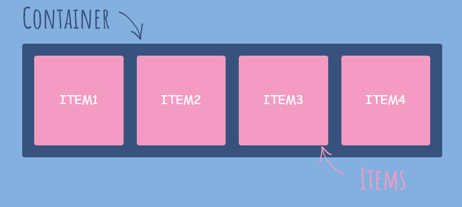
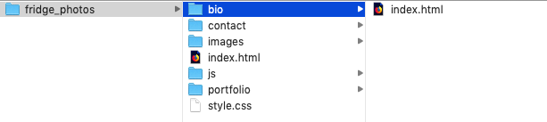
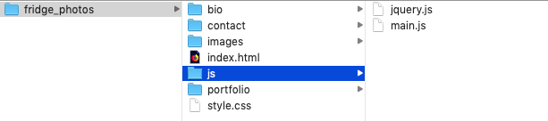

# Week 2

- TOC
{:toc}

Scripting For The Web  
Sep 9, 2020

## Today
- review homework
- review css
- css frameworks
- basic js
- what is the DOM?
- basic jquery
- start hw

### Check-in

- life check-in, school check-in
- and finally our class HTML+CSS check-in!

## HTML review

slides!

## CSS review

Do you love it or hate? (both?)

### Review our Syllabus Stylesheets

### Positioning things with CSS Flexbox



HTML:

```
 <div class="flex-container">
  <div>ITEM1</div>
  <div>ITEM2</div>
  <div>ITEM3</div>
  <div>ITEM4</div>
</div> 
```

CSS: 

```
.flex-container {
  display: flex;
}
```

With flexbox, you can use these CSS selectors:

- flex-direction
- flex-wrap
- flex-flow
- justify-content
- align-items
- align-content

#### Flex direction

Change the direction your items flow. Instead of left to right (the default), let's flow down in a column. Just add ```flex-direction: column;``` to the css of the container.

```
.flex-container {
  display: flex;
  flex-direction: column;
}
```


#### Flex wrap

```
.flex-container {
  display: flex;
  flex-wrap: wrap;
}
```

alternatively: ``` flex-wrap: nowrap;```


#### Justify-content - For SPACING

Use this to align items

```
.flex-container {
  display: flex;
  justify-content: center;
}
```


##### Many Other ways to justify-content

```
 justify-content: center;
 justify-content: flex-start;
 justify-content: flex-end;
 justify-content: space-around;
 justify-content: space-between;
```

*align-items is used for aligning* items!

Play with these [here](https://www.w3schools.com/csS/css3_flexbox.asp)

#### CSS Resources

- Definitive introduction: [Complete Guide to CSS Flexbox](https://css-tricks.com/snippets/css/a-guide-to-flexbox/)
- also good: CSS Flexbox [on w3schools](https://www.w3schools.com/csS/css3_flexbox.asp)

##### Fun learning resources:
- [Flexbox Froggy](https://flexboxfroggy.com/)  
- [Flexbox Defense](http://www.flexboxdefense.com/) tower defense game


# File System / File paths

File structure. File system. File paths. I know, you're yawning already. But if you understand the basics it will save you mistakes or problems later.

Here's the basics:

Your website must *sit* somewhere. You should build it in a folder, which we'll call a directory. When you are finished coding, you will upload it to a server. The name should avoid using spaces. It's better to use hypens ```-``` or underscores ```_```. An example: ```fridge_photos```. Whatever this folder is, it's called your *root directory*. In shorthand, this is written as ```/```, the forward slash.

Inside your root directory it is considered best practice to place a ```index.html``` file. Since the index file is a default, if someone visits your domain root (for example if you buy *fridgephotos.com*) then the browser will actually serve ```fridgephotos.com/index.html```, though it will just display ```fridgephotos.com```in the address bar.

In addition, you should have an external css page and javascript files here, if it's a simple site. For a more complex site, you may have a folder of css and a folder of javascript. You may also have a folder of images or other assets

  
Example basic file structure

With the above basic file structure your index.html could look like this:

```
<!DOCTYPE html>
<html>
  <head>
    <title>Fridge Photos</title>
    <link rel="stylesheet" type="text/css" href="style.css" >
  </head>
  <body>
    <h1>My photos</h1>
    
    
    
  </body>
</html>
```

### More advanced file structure (for bigger sites)

If you have a website with a number of pages, you may have tried adding more html pages to your root folder, with names like ```contact.html```, ```bio.html``` or even ```page2.html```. That is not considered best practice. The proper approach is make a separate directory inside your root directory for each page. And each of these will have their own index.html file. This way someone can visit ```fridgephotos.com/bio``` instead of ```fridgephotos.com/bio.html```.


View of the bio bio folder:

  
The bio directory has its own index.html page


View of the ```js``` javascript file folder:

  
You may have multiple files in a js directory

#### Example

Based on the above file structure for a more advanced site.

Let's say we are editing the bio page. We will have a bio photo, and we need to use two scripts, jquery.js and our own main.js on the page.

Remember that starting with the forward slash means starting in our root folder. So the following file ```/bio/index.html``` means the index.html file we are working on is inside a bio folder which is inside our fridge_photos folder!

**/bio/index.html**:

```
<!DOCTYPE html>
  <html>
    <head>
      <title>My Fridge Bio</title>

      <script src="/js/jquery.js"></script>
      <script src="/js/main.js"></script>
    </head>
    <body>
      <h1>My bio</h1>
      
    </body>
  </html>
```

For this page, we are loading the jquery.js file from the js folder located in the root directory since the file name in that line starts with ```/```.
The next line loads the main.js file in the same folder.

Check out the line of code with the image file above. A different way you could display the exact same image is:

```

```

This says to go up one folder (to the parent of the current folder holding the index.html file you are editing in the bio directory), then go in the images folder there and display the bio_photo.jpg image file.


### File structure cheatsheet

```
directory = a folder
. = current folder
.. = parent of current folder
/ = root directory

examples:
/images/photo1.jpg = photo1.jpg inside the images folder inside the root directory

../assets/head.jpg = the parent of this current folder has an assets folder in it with an image file head.jpg located inside that

```


## CSS frameworks!


A CSS framework is a library of CSS you can use to more rapidly create a website based on standards. They are often built with good defaults, are generally mobile-responsive, and are focused around clear UI patterns. The most famous is CSS Bootstrap. 

Some frameworks specialize in customizability. Others are drop-in. Most require CSS knowledge to be able to tailor the framework to match your site design goals and your individual assets of photos, text and other content.

PROs:

- Great design you can just 'drop-in'
- The little details are often thought-through and meticulously implemented
- cross-browser idiosyncracies have been worked out
- standardization makes it easier for a user to understand how to navigate your webpage

CONs:
- the design can look generic or overly product-y
- can be difficult to figure out how to customize
- may use design systems or code you have less or no previous experience in, such as CSS pre-processers 
- the documentation is generally written for advanced web developers

### Good beginner-friendly CSS frameworks:

#### "Classless" frameworks

Classless CSS refers to a framework that does not require you to add css classes and ID's to your own HTML page and should work *out of the box* without customization. The upside is an instantly-readable website. downside is that these sites can look generic and minimal.

- new.css - [demo](https://newcss.net/) - includes usage instructions
- Retro - [demo](https://markdowncss.github.io/retro/)
- Tufte CSS - [demo](https://edwardtufte.github.io/tufte-css/) and [code](https://github.com/edwardtufte/tufte-css) - *note this one requires you download a folder with fonts in it as well*


Huge list of classless css frameworks [here](https://github.com/dbohdan/classless-css)

#### w3.css framework

A step up from classless css, this is a beginner-friendly CSS framework that is easy to customize.

#### Here are two I have adapted and placed on Glitch.com:

- [Basic landing page](https://glitch.com/edit/#!/generic-professional-template) on Glitch

- [Basic 1page art portfolio](https://glitch.com/edit/#!/1page-portfolio-template) on Glitch

Many more w3.css templates can be found on the [w3schools templates page](https://www.w3schools.com/w3css/w3css_templates.asp)
# Homework

### Reading
- Read [What Happens When Type a URL in the browser?](https://medium.com/@maneesha.wijesinghe1/what-happens-when-you-type-an-url-in-the-browser-and-press-enter-bb0aa2449c1a)
- Be able to explain it!
- Read the [DOM tutorial](https://www.w3schools.com/Js/js_htmldom.asp) entire section down to Events page
- Read [A Five Minute Guide to Typography](http://pierrickcalvez.com/journal/a-five-minutes-guide-to-better-typography)

## Do Tutorials

- Read [Javascript Basics by JQuery Fundamentals](http://jqfundamentals.com/chapter/javascript-basics) on values, variables and functions. You can read more if you wan to. Write down any questions you have in your notebook. Bring the notebook to our next class.
- Do the w3schools [jQuery tutorial](https://www.w3schools.com/jquery/)
  - Be sure to really understand the sections:
  - [jQuery syntax](https://www.w3schools.com/jquery/jquery_syntax.asp)
  - [jQuery selectors](https://www.w3schools.com/jquery/jquery_selectors.asp)
  - [jQuery events](https://www.w3schools.com/jquery/jquery_events.asp)

## Create a bizarre/subversive jQuery site

Watch [They Live](https://www.youtube.com/watch?v=JI8AMRbqY6w)

Create a fake corporate webpage that appears to be about one thing. Use generic language, stock images, etc.

Use an event (clicking a button, a timer, or some other method) to trigger a change in the website that shows a subversive page. This could be a secret hacker ring, aliens, another civilization, or some group attempting to bring that corporation down, or perhaps show the company's actually true intentions. Use your imagination to make this wild and far out. You may want to plan and sketch this first in a notebook. You may struggle turning the idea into your head into reality via your code. Write down problems you can't solve in your notebook. Look for solutions. Take breaks! 

You have two weeks to do this assignment!

For next week:
- What is your concept?
- What is your corporation or entity's name?
- What is your method? Will you use a framework or handcode or...?
- Mock up the pages in a notebook or sketch on computer
- Start working on it. Create HTML, CSS to demonstrate next week.

# Method

1. Decide your fake corporate entity. Pick a name. Pick a google font to use, or several.
2. Go to [Pexels](https://www.pexels.com/public-domain-images/) or [Pixabay](https://pixabay.com/) public domain images and search for an image (or multiple images to use). Download them.
3. Set up your website in Glitch. You need your index.html, style.css, a link to jQuery and your own jquery script. Upload your images to assets. You can have more pages and other options but this is probably the minimum to get started. You don't need to use my starter code. It's just there to point out one example to get started.

When finished, link to your project's site from your class website you made last week.

### Optional readings

##### Resources for Mobile-Responsive Design

* [Designing For The Best Experience For All Users](https://www.w3schools.com/Css/css_rwd_intro.asp)
* [CSS Media Queries](https://www.w3schools.com/Css/css_rwd_mediaqueries.asp)
* [Viewport Units](https://css-tricks.com/fun-viewport-units/)
