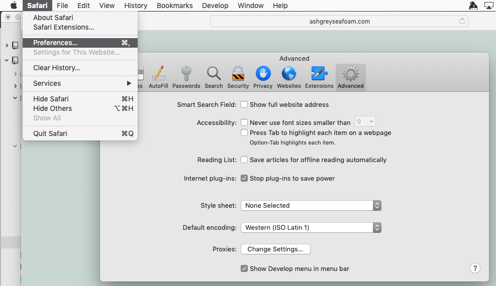

# Week 3

# schedule
- check-in
- questions
- group feedback on hw
- intro to JS
- coding time

# Today's questions
- How do you use Javascript?
- how and why do you use jQuery?
- what is the DOM?

## Warmup: CSS animation


##### CSS animation resources


- tutorial on [w3schools](https://www.w3schools.com/css/css3_animations.asp)
- CSS Animation - [Fade-In Example](https://www.tutorialspoint.com/css/css_animation_fade_in.htm)


## Javascript!

HTML is for content. CSS is for style. JavaScript is for interaction.  


Javascript as a name was selected because the Java language was popular at the time. They are not otherwise related. Over time Javascript was adopted by all browsers though each browser/engine may have its own implementation. Standards for JavaScript are maintained by an international committee and the standard is known as EcmaScript.

Javascript is a multiparadigm language, meaning there are many approaches to coding with it.

Javascript is *weakly* typed, meaning that the language does not have built in safety checks for memory and variable types. It is evaluated *just in time*. In contrast to Processing, for example, which is compiled (and checked for errors) before running.

Javascript as a language has evolved significantly over time. New language features have been implemented and adopted at varying times by different browsers. Ecmascript2015 aka ES6 brought significant changes to syntax for classes, types, functions and loops, among other changes.

Javascript includes support for working with text, arrays, dates, regular expressions, and basic manipulation of the DOM.

### What makes Javascript special?

Technically, Javascript is a scripting language in a host environment, which means that many applications or host environments can provide their own systems for accessing and executing it. Javascript can be used in web browsers but also in Adobe products, system software, embedded computers, databases, and other environments. It is increasingly used as the language that underlies the internet of things, so that tens of millions of devices can be accessed and controlled via Javascript.

### Where to use Javascript
- In your web browser's console
- Between ```<script>``` and ```</script>``` in your HTML page
- In an external file called by (for example) ```<script src="script.js"></script>``` on your HTML page
- And in the commandline/Terminal using Node.js

#### Advantages of External scripts
* It separates HTML and code
* It makes HTML and JavaScript easier to read and maintain
* Cached JavaScript files can speed up page loads
* you can load several

```
<script src="myScript1.js"></script>
<script src="myScript2.js"></script>
```

#### Accessing the browser console

###### Chrome console
  
Accessing the console in Chrome

###### Firefox console
  

###### Safari console (2 parts!)

In Safari, you must first go to File > Preferences and choose the Advanced tab and turn on the Developer tools. This will add a Developer Menu.



Now you can access the console.


### Hello World in Javascript

Normally, you'll have your Javascript code acting on your website, handling events (the mouse, page load, etc) or responding to input for example.

This isn't the normal use of JavaScript, but as a beginner it's helpful to know that JavaScript can produce some output very simply, in a few different ways:

* Writing into an HTML element, using innerHTML. [Example](https://www.w3schools.com/js/tryit.asp?filename=tryjs_output_dom)
* Writing into the HTML output using document.write(). [Example](https://www.w3schools.com/js/tryit.asp?filename=tryjs_output_write)
* Writing into an alert box, using window.alert(). [Example](https://www.w3schools.com/js/tryit.asp?filename=tryjs_output_write_over)
* Writing into the browser console, using console.log(). [Example](https://www.w3schools.com/js/tryit.asp?filename=tryjs_output_alert)

Hello World is typically the first program you write in a programming language when you are testing it out. It tells you whether you can get a basic program to run. A typical *Hello World* program in Javascript could use any of the 4 above methods.

### Entering Javascript directly in the console

Open the Javascript web console. Here you see error messages and warnings from the site you are viewing. You can also enter code directly and press enter and it will execute.

```
console.log('Hello World');
```

This will print ```Hello World``` as output.

console.log looks really ugly. If it helps, think of it as saying *print out*.

### Placing Javascript within script tags

Leave your console open.

Go back to your index.html file or make a new one.

In your page somewhere add the opening and closing script tags, and put some basic Javascript code in there to print text on the console.

```
<script>
  console.log('This will print out in the console');
</script>
```

Now reload the page in the browser and look at the console. The statement should be printed there.

### Using an external Javascript file

Just like we do with an external css stylesheet it's best practice to use an external Javascript file that you call in your html file. Most of the time you will want to put this script near the end of your page right before the closing ```</body>``` tag. We do this so our page content loads (text, images...) before our script runs so there is something to see if our site loads slowly.

###### Example

index.html:

```
<!DOCTYPE html>
<html>
  <head>
    <title>Testing the console</title>
  </head>
  <body>
    <h1>Hello World</h1>
    <script src="main.js"></script>
  </body>
</html>
```

main.js:

```
console.log('Hi. From an external script');
```

Check the web console to confirm the text from main.js printed in the console.

## Javascript Syntax

Javascript code starts executing instructions in order.

#### Comments


Comments are notes to yourself or other programmers. The browser skips it. In addition to writing helpful notes for when you reopen your software after a break, it can be helpful to use commenting to turn on and off different lines of code.

```
//this is a comment
```

```
/* 
this is
a multi line
comment. I don't use them very much
*/
```

#### Semicolons

Semicolons ```;``` are generally used to end executable statements. You can even use them to have multiple statements on a single line of code. The semicolons are optional when each line has a single statement, but it's good practice to use them anyway.

```
var message = "some text";
console.log(message);
```

### Data Types

Variables are used to store data for later. Javascript is a *weakly* typed language. You don't need to declare a variable's type and there is no error checking.

JavaScript variables can hold many data types: numbers, strings, objects and more (including functions, which we'll get to later). Unlike other languages, you can use ```var``` to declare all variable types. Note that you don't specify an integer nor float.

Examples

```
var age = 21;   // Number
var weight = 145.3; // Number
var name = "Cardi B";  // String
var person  = {firstName:"Dwayne",
 middleName:"The Rock",
 lastName:"Johnson"};    // Object
```

Now that those variables are set, we can use them.

```
console.log("Quiet, I'm listening to "+name);
```

Notice how I broke up *The Rock's* name above to make it easier for me to read. **Javascript collapses all spaces**, lines, tabs that are bigger than a space into a single space.

- Numbers - You do not need to specify an integer or float the way you do in many other languages.
- Strings - a sequence of Unicode characters

###### Some other values

* null - a non-value
* undefined - not yet initialized
* boolean - ```true``` or ```false```

#### Operations
* Boolean operations such as ```&&``` (logical and), ```||``` (logical or), and ```!``` (logical not)

#### More about Variables
* *let* is the new *var* - ```let``` has *block scope* while ```var``` does not. Simply put, many people have transitioned to using ```let``` instead of var and for your code it doesn't matter which you pick to use.
* ```const``` is a variable whose value will not change! Reassigning its value will throw an error. It also has block scope.

## Syntax
* lines end with a ;
* Flow order (top to bottom)
* comments start with //
* increment with ```++``` and decrement with ```--```
* add strings together with ```txt = string1 + " " + string2;```

## Functions are code blocks
* they break your code into manageable chunks
* named functions can be called
* anonymous functions used once

```
function myFunction() {
    var contents = $('#contents');

    $('#demo1').html("Hello World");
}
```

### Control Structures

* ```if```, ```else if```, ```else```

Basic if statement

```
if (name === 'Belcalis Marlenis Almanzar'){
    console.log(name+", also known as Cardi B.");
}
```

More complex if statements

```
if (name === 'Quavo'){
  console.log('Right on');
} else if (name === 'Offset'){
  console.log('Totally');
} else if (name === 'Takeoff'){
  console.log('Okay');
} else {
  console.log('Hold on, who are you?');
}
```

### Operators

* ```==``` equal to
* ```!=```	not equal
* ```>```	greater than
* ```<```	less than
* ```>=```	greater than or equal to
* ```<=``` less than or equal to

### Logic

* AND ```&&```
* OR ```||```
* NOT ```!```

### More JavaScript

#### Arrays

```
students = [
  'Jonathan','Joseph','Erinn','Danylo','Anthony','Emmie','Victoria','Katherine','Mafe','Zachary','Emory','Keeshawn','Ana','Wadiah','Vlad'];
]
```

You can access an array by specifying the index.

```
  console.log(students[0]); //prints out 'Jonathan'
```

Arrays have length

```
console.log(students.length);
```

The length is the total number of entries. It's common to access or do something with the contents using a loop.

```
console.log('The Students are: ');

for (let i=0; i < students.length; i++){
    console.log(students[i]);
}
```

Note: The last entry to an array is not ```arrayName[arrayName.length];```
Remember that if we have an array with 5 entries, we will have an index 0, 1, 2, 3, 4. The last entry is therefore ```arrayName[arrayName.length-1];```


#### For loops

```
var genres = ['Bebop', 'Rocksteady', 'Dub', 'Ska'];

//looping through an array
for (let i = 0; i < genres.length; i++) {
        console.log(genres[i]);
    }
```

## The DOM

Now that we understand the basics of Javascript, let's consider what it can do:

-  JavaScript can change all the HTML elements in the page
-  JavaScript can change all the HTML attributes in the page
-  JavaScript can change all the CSS styles in the page
-  JavaScript can remove existing HTML elements and attributes
-  JavaScript can add new HTML elements and attributes
-  JavaScript can react to all existing HTML events in the page
-  JavaScript can create new HTML events in the page

The HTML DOM is a standard for how to get, change, add, or delete HTML elements.

DOM stands for Document Object Model.

HTML elements are objects.   
Their properties can be changed.  
We have different methods for accessing these.  
We can have our HTML change based off specific events (a page opening, resizing, mouse pressed, etc.)  


The DOM works like a tree, with nodes branching off that below. We can work on these nodes, remove them, add to them, change their properties, etc.


## jQuery Basics

*- note: there are slides*

We've learned a ton so far. We now understand the basics of Javascript values, variables and functions. We understand the concept of the DOM and know that Javascript lets us modify the DOM.

With that knowledge we're going to add one other tool. This is the Javascript library jQuery.

Broadly stated, a programming library is a package of code with pre-written function calls and other tools to simplify working in a specific area or category. jQuery is a Javascript library that makes programming in Javascript easier and it is quick to learn.

To use jQuery you first must pull it into your index file on the page where you want to use it. Then you follow that with a link to your own jQuery code.

Example

```
<!DOCTYPE html>
<html>
<title>Minimal example - working with jquery<title>
  <body>
    <script src="js/jquery.js">
    <script src="my-script.js">
  </body>
</html>
```

jQuery is the most famous Javascript library and at one point could be found on over 60% of websites. There are 2 options to use it:

### Download jQuery and save it in your project folder

[Download it](https://jquery.com/download/). Choose the compressed, production version 3.3.1.
Then add a link to it in your html index document. Then add your own jQuery code after that.


### or use a CDN

A CDN means Content Delivery Network. Since so much of the web uses jQuery, there are companies and foundations that provide free links to jQuery online. Rather than having folks download jQuery from each website that uses it, a website developer can instead link to one of these centrally provided copies of jQuery online. That way, when someone visits your webpage, they will already have a copy of jQuery cached in their browser, and so your page will load faster.

Example - exactly same as above except for the jquery link

```
<!DOCTYPE html>
<html>
<title>Minimal example - working with jquery<title>
  <body>
    <script src="https://ajax.googleapis.com/ajax/libs/jquery/3.3.1/jquery.min.js"></script>
    <script src="my-script.js">
  </body>
</html>
```

If you avoid Google products you can use the jQuery foundation's CDN instead, though Google's is likely the fastest to load.

```
<script src="https://code.jquery.com/jquery-3.3.1.min.js"
			  integrity="sha256-FgpCb/KJQlLNfOu91ta32o/NMZxltwRo8QtmkMRdAu8="
			  crossorigin="anonymous"></script>
```

### What's it for?

Same things as Javascript

* Dynamic change
* Interaction!

### It goes between ```<script>``` tags

* In HEAD or BODY

- best practices are to add link to jquery and then link to your own external javascript file right before the closing ```</body>``` tag
- why? so your HTML and CSS is loaded first and then your script is applied to them


The ```$(document)``` part is what tells our program to use jQuery to interpret/run our code on the webpage.


### using jQuery to change our css stylesheet

```
$(window).ready(function() {
   
   //runs once at start
   changeBG(); 
   
   //runs in a loop every 5 seconds
   setInterval(changeBG, 5000); 
   
   
   //declare a function changeBG
   
   function changeBG() {
     let num = Math.floor(Math.random()*18);
     $('body').css('background', 'url("css/'+num+'.css")');
   }
 });
 ```

# Homework

## jQuery practice

- Finish your project!
- Gather feedback from classmates
- Make sure you add a link to jQuery in the head, and a call to your external script before you close ```</body>```
